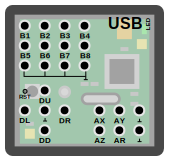
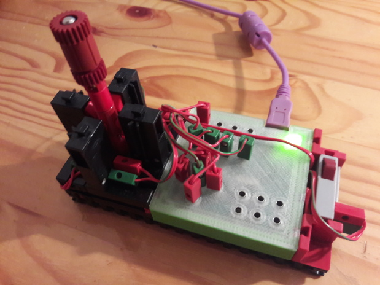
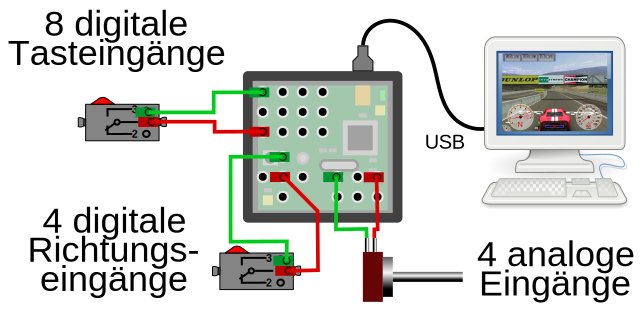
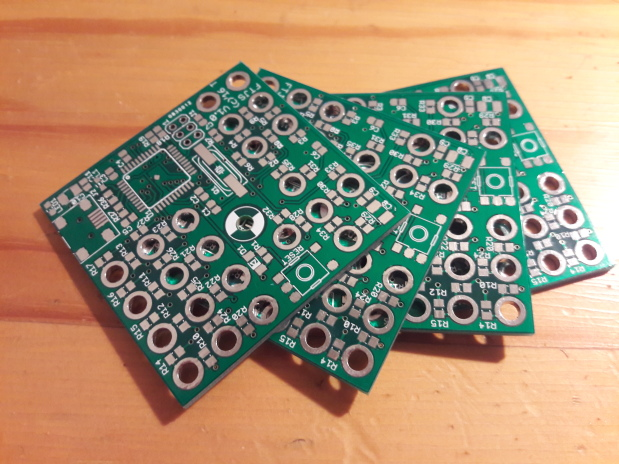

# fischertechnik-joystick

This is a simple joystick interface for fischertechnik. It connects
to any PC and has ft compatible IOs for 8 fire buttons, four digital
direction buttons and four analog axes.

 

This repository contains the schematic and the board layout in eagle format,
the firmware source code and a 3D printable case design.

